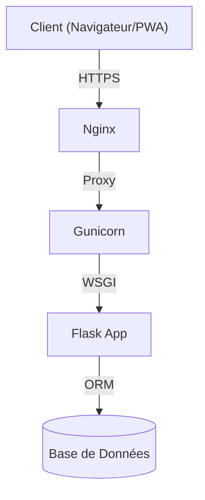

     

# Bellari Concept - CMS & Site Vitrine de Luxe

> **© MOA Digital Agency (myoneart.com) - Auteur : Aisance KALONJI**
> *Ce code est la propriété exclusive de MOA Digital Agency. Usage interne uniquement. Toute reproduction ou distribution non autorisée est strictement interdite.*

[Switch to English Version](./BellariConcept_README_en.md)

Bellari Concept est une solution logicielle sur mesure combinant un site vitrine haute performance et un CMS propriétaire bilingue. Conçu pour le secteur du design d'intérieur de luxe, il offre une gestion de contenu intuitive, une sécurité renforcée et une expérience utilisateur fluide (PWA).

## Architecture Globale



> **AVERTISSEMENT LÉGAL**
>
> Ce logiciel est protégé par les lois sur la propriété intellectuelle.
> Tout accès, copie, ou modification sans autorisation écrite de **MOA Digital Agency** est strictement interdit.
> Les contrevenants s'exposent à des poursuites judiciaires immédiates.

## Installation & Démarrage Rapide

### 1. Cloner et Installer
```bash
# Cloner le dépôt (Accès restreint)
git clone <url_repo>
cd bellari-concept

# Installer les dépendances
pip install -r requirements.txt
```

### 2. Configuration
Renommez `.env.example` en `.env` (si disponible) ou créez-le :
```ini
SESSION_SECRET=votre_secret
DATABASE_URL=sqlite:///bellari.db
```

### 3. Lancer le Serveur
```bash
python app.py
```
L'application sera accessible sur `http://localhost:5000`.

## Index de la Documentation

Pour une documentation technique détaillée, consultez le dossier `docs/` :

*   [Architecture Détaillée](./docs/BellariConcept_architecture.md)
*   [Liste des Fonctionnalités](./docs/BellariConcept_features_full_list.md)
*   [Guide de Déploiement](./docs/BellariConcept_deployment.md)

---
*© 2024 MOA Digital Agency. Tous droits réservés.*
