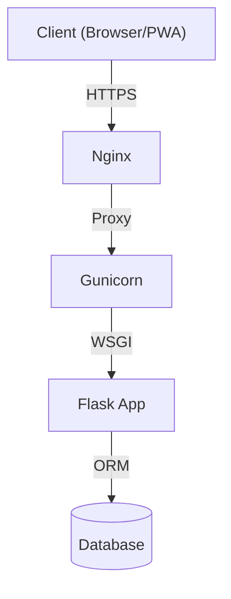

     

# Bellari Concept - Luxury CMS & Showcase Site

> **© MOA Digital Agency (myoneart.com) - Author: Aisance KALONJI**
> *This code is the exclusive property of MOA Digital Agency. Internal use only. Any unauthorized reproduction or distribution is strictly prohibited.*

[Passer à la version Française](./BellariConcept_README.md)

Bellari Concept is a bespoke software solution combining a high-performance showcase site and a proprietary bilingual CMS. Designed for the luxury interior design sector, it offers intuitive content management, reinforced security, and a seamless user experience (PWA).

## Global Architecture



> **LEGAL WARNING**
>
> This software is protected by intellectual property laws.
> Any access, copying, or modification without written authorization from **MOA Digital Agency** is strictly prohibited.
> Violators are subject to immediate legal action.

## Installation & Quick Start

### 1. Clone and Install
```bash
# Clone the repository (Restricted access)
git clone <repo_url>
cd bellari-concept

# Install dependencies
pip install -r requirements.txt
```

### 2. Configuration
Rename `.env.example` to `.env` (if available) or create it:
```ini
SESSION_SECRET=your_secret
DATABASE_URL=sqlite:///bellari.db
```

### 3. Start Server
```bash
python app.py
```
The application will be accessible at `http://localhost:5000`.

## Documentation Index

For detailed technical documentation, consult the `docs/` folder:

*   [Detailed Architecture](./docs/BellariConcept_architecture_en.md)
*   [Full Features List](./docs/BellariConcept_features_full_list_en.md)
*   [Deployment Guide](./docs/BellariConcept_deployment_en.md)

---
*© 2024 MOA Digital Agency. All rights reserved.*
