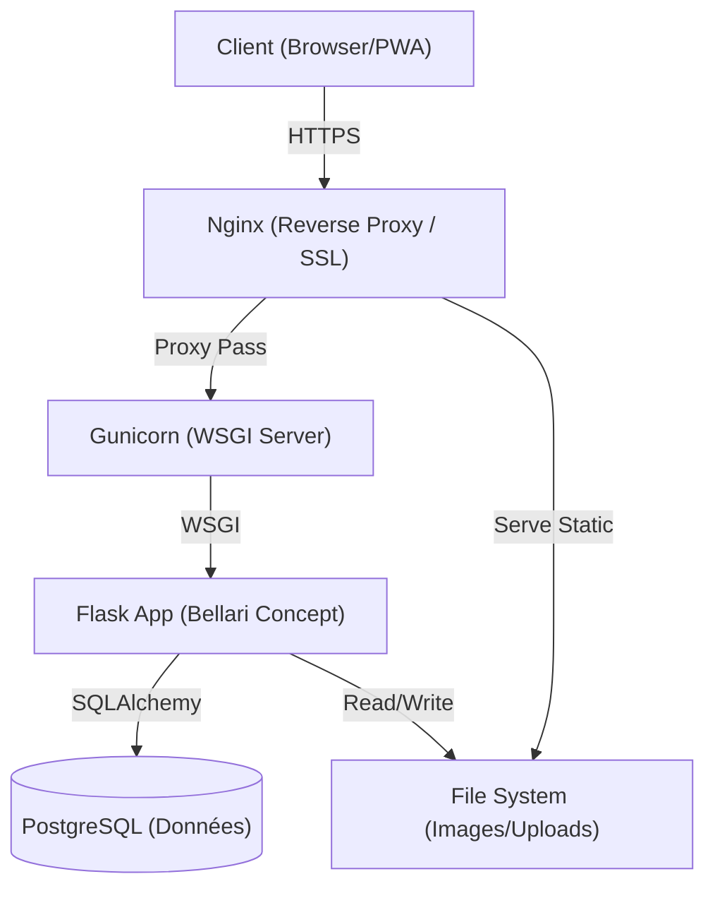

# Bellari Concept


> **PROPRIÉTÉ EXCLUSIVE DE MOA DIGITAL AGENCY LLC**
>
> **Auteur :** Aisance KALONJI (www.aisancekalonji.com)
>
> Ce code source est **privé et confidentiel**. Toute copie, modification, distribution ou utilisation non autorisée, totale ou partielle, est strictement interdite et fera l'objet de poursuites judiciaires immédiates conformément aux lois internationales sur la propriété intellectuelle.
>
> Voir le fichier [LICENSE.md](./LICENSE.md) pour les termes complets.

---

## 🏛️ Vue d'Ensemble

**Bellari Concept** est une solution CMS sur-mesure de haut standing dédiée aux cabinets d'architecture et de design d'intérieur. Conçue pour la performance, le référencement (SEO) et l'expérience utilisateur, elle intègre une gestion de contenu bilingue (FR/EN) et une architecture PWA (Progressive Web App).

### Architecture Globale



## 🚀 Fonctionnalités Clés

*   **CMS Bilingue Synchrone :** Gestion de contenu FR/EN avec alignement strict des sections.
*   **Progressive Web App (PWA) :** Installable sur mobile (iOS/Android) avec manifeste dynamique configurable.
*   **Sécurité Avancée :** Hachage Argon2, Protection CSRF, Content Security Policy (CSP) stricte.
*   **SEO Technique :** Sitemap XML automatique, Robots.txt dynamique, Données structurées JSON-LD.
*   **Administration Complète :** Dashboard, Gestion des médias, Configuration du site à chaud.

## 📚 Documentation Officielle

La documentation technique détaillée se trouve dans le dossier `docs/` :

*   [📘 Bible des Fonctionnalités](docs/Bellari_Concept_Features_Full_List.md)
*   [🏗️ Architecture Technique](docs/Bellari_Concept_Architecture.md)
*   [🛡️ Architecture de Sécurité](docs/Bellari_Concept_Security.md)
*   [🚀 Guide de Déploiement](docs/Bellari_Concept_Deployment.md)
*   [💻 Guide d'Installation (Dev)](docs/Bellari_Concept_Installation.md)
*   [📖 Guide Utilisateur (Admin)](docs/Bellari_Concept_User_Guide.md)

## ⚡ Démarrage Rapide (Développement)

```bash
# 1. Cloner le dépôt (Accès restreint)
git clone https://github.com/moa-digital/bellari-concept.git
cd bellari-concept

# 2. Créer l'environnement virtuel
python3 -m venv .venv
source .venv/bin/activate

# 3. Installer les dépendances
pip install -r requirements.txt

# 4. Initialiser la Base de Données
# (Assurez-vous d'avoir configuré le fichier .env)
python init_db.py

# 5. Lancer le serveur de développement
python main.py
```

## 📞 Support & Contact

Pour toute demande technique ou commerciale concernant ce produit :

*   **Agence :** MOA Digital Agency LLC
*   **Site Web :** [www.myoneart.com](https://www.myoneart.com)
*   **Auteur :** Aisance KALONJI

---
*Copyright © 2025 MOA Digital Agency LLC. Tous droits réservés.*
