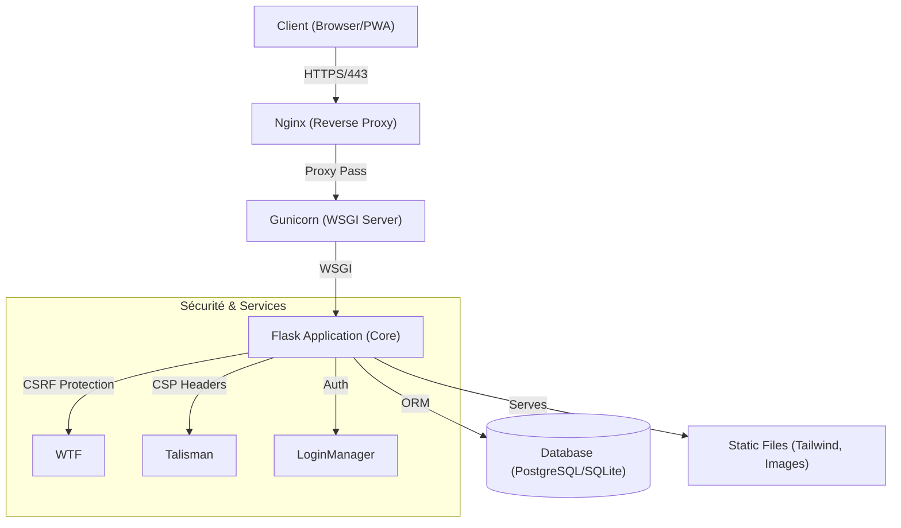

[ 🇫🇷 Français ] | [ 🇬🇧 English ](README_en.md)

# ⚠️ AVERTISSEMENT LEGAL / LEGAL WARNING
**PROPRIÉTÉ EXCLUSIVE DE MOA DIGITAL AGENCY (myoneart.com)**
**AUTEUR : AISANCE KALONJI**

Ce code source est **STRICTEMENT CONFIDENTIEL ET PROPRIÉTAIRE**.
Toute reproduction, distribution ou modification non autorisée est interdite.
Usage interne uniquement. Voir le fichier `LICENSE` pour plus de détails.

---

# 🏗️ Bellari Concept - CMS & PWA d'Architecture Intérieure

**Bellari Concept** est une solution CMS sur-mesure développée pour une agence de design d'intérieur de luxe. Il combine la puissance d'une application Flask robuste avec l'expérience utilisateur fluide d'une Progressive Web App (PWA).

## 🌟 Vision du Produit
Ce n'est pas un simple site vitrine, mais une plateforme complète permettant à l'agence de gérer ses projets, ses contenus bilingues et son image de marque en toute autonomie, avec une sécurité de niveau entreprise.

## 🏛️ Architecture Technique



## 🚀 Fonctionnalités Clés

*   **Gestion Bilingue Native (FR/EN) :** Synchronisation intelligente des sections de contenu.
*   **Support PWA Complet :** Manifest dynamique, icônes configurables, mode hors ligne.
*   **CMS Puissant :** Gestion des pages, sections (Hero, Intro, Features...), et galerie d'images.
*   **Sécurité Renforcée :** Protection CSRF globale, Content Security Policy (CSP), Cookies sécurisés, Hachage Argon2.
*   **Optimisation SEO :** Meta tags dynamiques, Sitemap XML automatique, Robots.txt configurable.

## 📚 Documentation Officielle

La documentation complète est disponible dans le dossier `docs/` :

*   **[ 📜 Liste Complète des Fonctionnalités ](docs/BellariConcept_features_full_list.md)** : La "Bible" du projet.
*   **[ ⚙️ Architecture Technique ](docs/BellariConcept_Technical_Architecture.md)** : Stack, BDD, Déploiement.
*   **[ 📖 Guide Utilisateur & Admin ](docs/BellariConcept_Admin_Guide.md)** : Manuel d'utilisation du CMS.

## 🛠️ Installation & Démarrage (Interne)

### Pré-requis
*   Python 3.11+
*   PostgreSQL (Production) ou SQLite (Dev)
*   Environnement virtuel (venv)

### Configuration Rapide
1.  Cloner le dépôt (Accès restreint).
2.  Créer un fichier `.env` basé sur `.env.example` (ou voir `deploy.sh`).
3.  Installer les dépendances :
    ```bash
    pip install -r requirements.txt
    ```
4.  Initialiser la base de données :
    ```bash
    python init_db.py
    ```
5.  Lancer le serveur de développement :
    ```bash
    python app.py
    ```

---
© 2024-2025 MOA Digital Agency (myoneart.com) - Auteur : Aisance KALONJI. Tous droits réservés.
