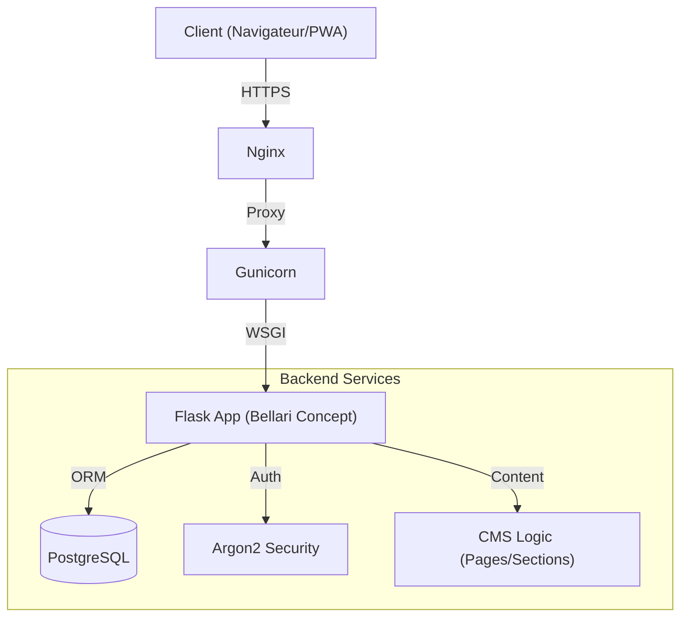

     

# Bellari Concept - CMS Architecture & Design

> **⚠️ AVERTISSEMENT JURIDIQUE STRICT**
>
> Ce logiciel, incluant tout le code source, la documentation et les ressources graphiques, est la **PROPRIÉTÉ EXCLUSIVE** de **MOA Digital Agency** et **Aisance KALONJI**.
>
> *   **Usage Interne Uniquement :** L'utilisation est limitée au personnel autorisé de MOA Digital Agency.
> *   **Interdiction Totale :** Toute copie, modification, redistribution, vente ou ingénierie inverse est strictement interdite sans accord écrit préalable.
> *   **Poursuites :** Tout contrevenant s'expose à des poursuites judiciaires immédiates.
>
> Voir le fichier [LICENSE](./LICENSE) pour les termes complets.

---

**Bellari Concept** est une solution CMS sur-mesure de haut niveau, conçue pour gérer la présence numérique d'une firme d'architecture d'intérieur de luxe. Alliant performance technique (Flask/Gunicorn) et flexibilité éditoriale, il offre une expérience utilisateur premium et une administration sécurisée.

## 🏗️ Architecture du Système

Le système repose sur une architecture MVC robuste déployée derrière un reverse-proxy Nginx.



## 📑 Table des Matières

1.  [Aperçu Technique](#-stack-technique)
2.  [Installation Rapide](#-installation--démarrage)
3.  [Documentation Complète](#-documentation)
4.  [Fonctionnalités Clés](#-fonctionnalités-clés)

## 🛠 Stack Technique

*   **Backend :** Python 3.11, Flask 3.0, Werkzeug.
*   **Base de Données :** PostgreSQL 15, SQLAlchemy ORM.
*   **Frontend :** Jinja2 Templates, TailwindCSS (CDN), HTML5.
*   **Sécurité :** Flask-WTF (CSRF), Talisman (CSP), Secure Cookies.
*   **Déploiement :** Gunicorn, Nginx, Docker-ready.

## 🚀 Installation & Démarrage

Le projet inclut un script d'installation automatisé pour les environnements Linux/macOS.

```bash
# 1. Cloner le dépôt privé
git clone <URL_DU_DEPOT>

# 2. Lancer le script de déploiement
chmod +x deploy.sh
./deploy.sh

# 3. Lancer le serveur (Dev)
source .venv/bin/activate
python app.py
```

Pour un déploiement en production, consultez le guide dédié ci-dessous.

## 📚 Documentation

Une documentation exhaustive est disponible dans le dossier `docs/` :

*   **[Architecture Système](./docs/Bellari_Concept_Architecture_FR.md)** : Détails des flux de données et composants.
*   **[Liste des Fonctionnalités](./docs/Bellari_Concept_Features_Full_List_FR.md)** : "Bible" fonctionnelle du projet (CMS, PWA, SEO).
*   **[Guide de Déploiement](./docs/Bellari_Concept_Deployment_FR.md)** : Procédures VPS, Nginx et maintenance.

## ✨ Fonctionnalités Clés

*   **Bilinguisme Natif :** Gestion synchronisée FR/EN des sections de contenu.
*   **PWA Ready :** Installation mobile, fonctionnement hors-ligne partiel.
*   **Admin Sécurisée :** Gestion des pages, upload d'images, configuration du site.
*   **SEO Automatisé :** Génération de Sitemap.xml et Robots.txt dynamiques.

---
*Développé avec ❤️ et rigueur par MOA Digital Agency.*
