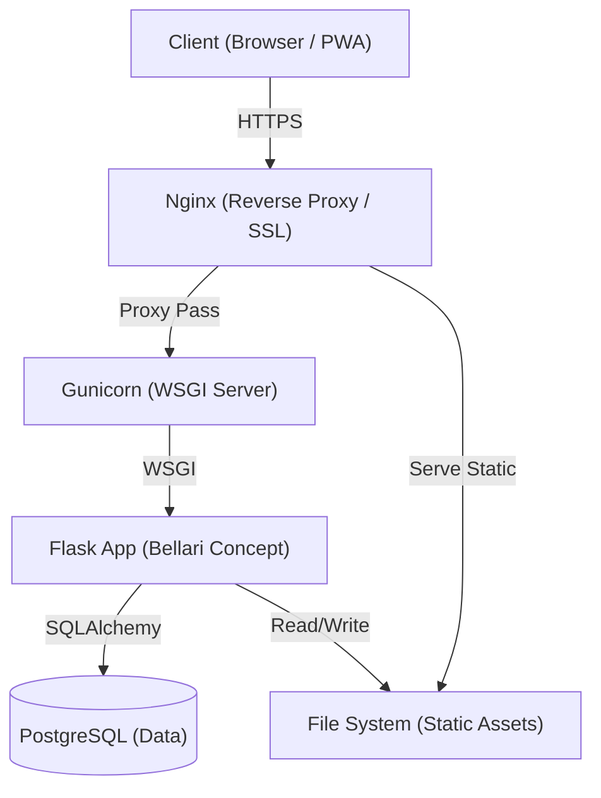

     

# Bellari Concept - Interior Design CMS

**[🇫🇷 Version Française](./README_FR.md)**

> **⚠️ STRICTLY PROPRIETARY SOFTWARE**
>
> This software is the confidential and proprietary property of **MOA Digital Agency** / **Aisance KALONJI**.
> Any unauthorized copying, alteration, distribution, transmission, performance, display or other use of this material is prohibited.
> **INTERNAL USE ONLY.**

Bellari Concept is a high-end Content Management System (CMS) designed for an interior design firm. It features a robust bilingual architecture (English/French), a dynamic section builder, and Progressive Web App (PWA) capabilities.

## Architecture Overview

The system is built on a monolithic Flask architecture, optimized for security and performance.



## Table of Contents

1.  [Features](#features)
2.  [Installation](#installation)
3.  [Documentation](#documentation)
4.  [Legal](#legal)

## Features

*   **Bilingual Core:** Seamless English/French content management with synchronized sections.
*   **Dynamic Sections:** Modular page building (Hero, Service, Gallery, Contact).
*   **Secure Admin:** Argon2 hashing, CSRF protection, and role-based access.
*   **PWA Ready:** Installable on mobile/desktop with offline asset caching.
*   **SEO Optimized:** Automatic Sitemap generation, OpenGraph tags, and configurable metadata.

## Installation

### Prerequisites

*   Python 3.11+
*   PostgreSQL 14+ (or SQLite for dev)

### Quick Start (Development)

```bash
# 1. Clone the repository (Authorized personnel only)
git clone <repo_url>
cd bellari-concept

# 2. Create virtual environment
python3 -m venv .venv
source .venv/bin/activate

# 3. Install dependencies
pip install -r requirements.txt

# 4. Configure Environment
# Copy .env.example to .env and set your credentials
cp .env.example .env

# 5. Initialize Database
python init_db.py

# 6. Run
python main.py
```

## Documentation

Comprehensive documentation is available in the `docs/` directory.

| Document | Description | Language |
| :--- | :--- | :--- |
| **[Technical Architecture](docs/Bellari_Concept_Architecture_EN.md)** | Stack details, security flow, data model. | EN |
| **[Deployment Guide](docs/Bellari_Concept_Deployment_EN.md)** | Production setup (Nginx, Gunicorn, VPS). | EN |
| **[Full Feature List](docs/Bellari_Concept_Features_Full_List_EN.md)** | Detailed breakdown of all functionalities. | EN |
| **[User Guide](docs/Bellari_Concept_User_Guide_EN.md)** | Admin panel manual for content managers. | EN |

## Legal

**Copyright (c) 2024 MOA Digital Agency.** All Rights Reserved.

Use of this software is subject to the terms of the Proprietary License Agreement located in the `LICENSE` file.
