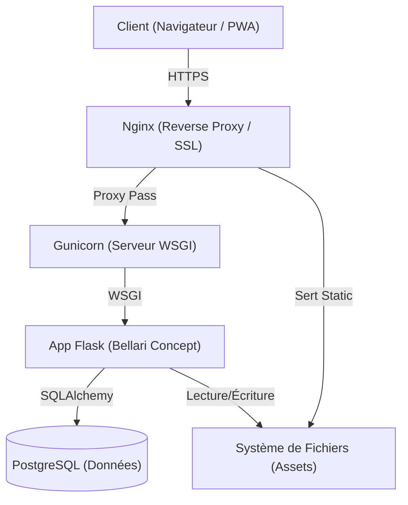

     

# Bellari Concept - CMS Design d'Intérieur

**[🇬🇧 English Version](./README.md)**

> **⚠️ LOGICIEL STRICTEMENT PROPRIÉTAIRE**
>
> Ce logiciel est la propriété confidentielle et exclusive de **MOA Digital Agency** / **Aisance KALONJI**.
> Toute copie, altération, distribution, transmission, représentation, affichage ou autre utilisation non autorisée est interdite.
> **USAGE INTERNE UNIQUEMENT.**

Bellari Concept est un CMS haut de gamme conçu pour une agence d'architecture d'intérieur. Il offre une architecture bilingue robuste (Anglais/Français), un constructeur de sections dynamique et des capacités PWA (Progressive Web App).

## Architecture Technique

Le système repose sur une architecture Flask monolithique, optimisée pour la sécurité et la performance.



## Table des Matières

1.  [Fonctionnalités](#fonctionnalités)
2.  [Installation](#installation)
3.  [Documentation](#documentation)
4.  [Mentions Légales](#mentions-légales)

## Fonctionnalités

*   **Cœur Bilingue :** Gestion transparente du contenu Anglais/Français avec sections synchronisées.
*   **Sections Dynamiques :** Construction modulaire des pages (Hero, Service, Galerie, Contact).
*   **Admin Sécurisée :** Hachage Argon2, protection CSRF et contrôle d'accès strict.
*   **PWA Ready :** Installable sur mobile/desktop avec cache hors-ligne.
*   **SEO Optimisé :** Génération automatique de Sitemap, balises OpenGraph et métadonnées configurables.

## Installation

### Prérequis

*   Python 3.11+
*   PostgreSQL 14+ (ou SQLite pour dev)

### Démarrage Rapide (Développement)

```bash
# 1. Cloner le dépôt (Personnel autorisé uniquement)
git clone <repo_url>
cd bellari-concept

# 2. Créer l'environnement virtuel
python3 -m venv .venv
source .venv/bin/activate

# 3. Installer les dépendances
pip install -r requirements.txt

# 4. Configurer l'Environnement
# Copier .env.example vers .env et définir vos identifiants
cp .env.example .env

# 5. Initialiser la Base de Données
python init_db.py

# 6. Lancer le serveur
python main.py
```

## Documentation

Une documentation complète est disponible dans le répertoire `docs/`.

| Document | Description | Langue |
| :--- | :--- | :--- |
| **[Architecture Technique](docs/Bellari_Concept_Architecture_FR.md)** | Détails stack, flux sécurité, modèle de données. | FR |
| **[Guide de Déploiement](docs/Bellari_Concept_Deployment_FR.md)** | Installation Production (Nginx, Gunicorn, VPS). | FR |
| **[Liste des Fonctionnalités](docs/Bellari_Concept_Features_Full_List_FR.md)** | Détail exhaustif des fonctionnalités. | FR |
| **[Guide Utilisateur](docs/Bellari_Concept_User_Guide_FR.md)** | Manuel d'administration pour gestionnaires de contenu. | FR |

## Mentions Légales

**Copyright (c) 2024 MOA Digital Agency.** Tous Droits Réservés.

L'utilisation de ce logiciel est soumise aux termes de l'Accord de Licence Propriétaire situé dans le fichier `LICENSE`.
