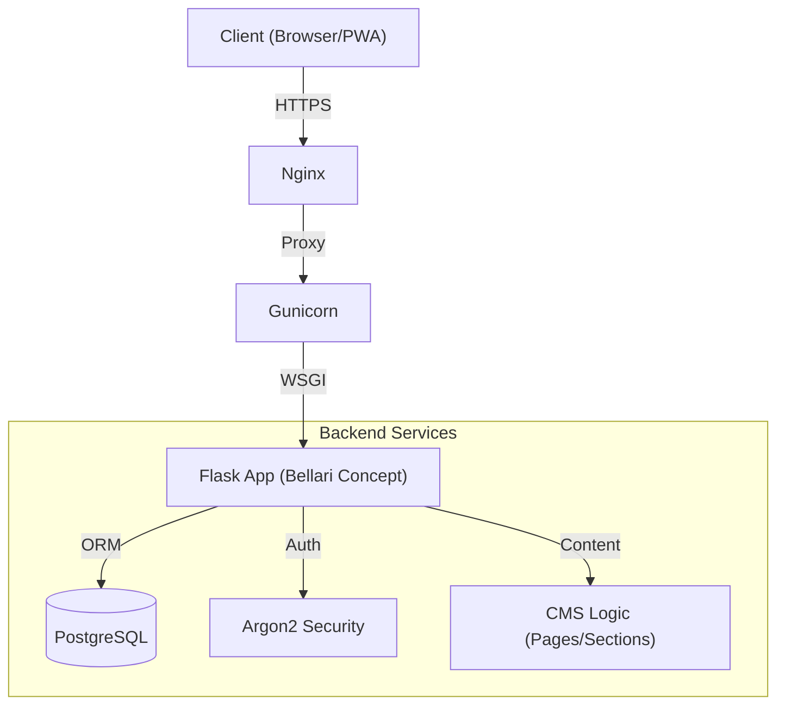

     

# Bellari Concept - CMS Architecture & Design

> **⚠️ STRICT LEGAL WARNING**
>
> This software, including all source code, documentation, and graphical assets, is the **EXCLUSIVE PROPERTY** of **MOA Digital Agency** and **Aisance KALONJI**.
>
> *   **Internal Use Only:** Usage is strictly limited to authorized personnel of MOA Digital Agency.
> *   **Total Prohibition:** Any copying, modification, redistribution, sale, or reverse engineering is strictly prohibited without prior written agreement.
> *   **Prosecution:** Any violator will be subject to immediate legal action.
>
> See the [LICENSE](./LICENSE) file for full terms.

---

**Bellari Concept** is a high-level bespoke CMS solution designed to manage the digital presence of a luxury interior design firm. Combining technical performance (Flask/Gunicorn) with editorial flexibility, it offers a premium user experience and secure administration.

## 🏗️ System Architecture

The system relies on a robust MVC architecture deployed behind an Nginx reverse proxy.



## 📑 Table of Contents

1.  [Technical Overview](#-technical-stack)
2.  [Quick Install](#-installation--start)
3.  [Full Documentation](#-documentation)
4.  [Key Features](#-key-features)

## 🛠 Technical Stack

*   **Backend:** Python 3.11, Flask 3.0, Werkzeug.
*   **Database:** PostgreSQL 15, SQLAlchemy ORM.
*   **Frontend:** Jinja2 Templates, TailwindCSS (CDN), HTML5.
*   **Security:** Flask-WTF (CSRF), Talisman (CSP), Secure Cookies.
*   **Deployment:** Gunicorn, Nginx, Docker-ready.

## 🚀 Installation & Start

The project includes an automated installation script for Linux/macOS environments.

```bash
# 1. Clone the private repository
git clone <REPO_URL>

# 2. Launch the deployment script
chmod +x deploy.sh
./deploy.sh

# 3. Start the server (Dev)
source .venv/bin/activate
python app.py
```

For a production deployment, please consult the dedicated guide below.

## 📚 Documentation

Exhaustive documentation is available in the `docs/` folder:

*   **[System Architecture](./docs/Bellari_Concept_Architecture_EN.md)** : Details of data flows and components.
*   **[Full Features List](./docs/Bellari_Concept_Features_Full_List_EN.md)** : The functional "Bible" of the project (CMS, PWA, SEO).
*   **[Deployment Guide](./docs/Bellari_Concept_Deployment_EN.md)** : VPS, Nginx, and maintenance procedures.

## ✨ Key Features

*   **Native Bilingual:** Synchronized FR/EN content section management.
*   **PWA Ready:** Mobile installation, partial offline functionality.
*   **Secure Admin:** Page management, image uploads, site configuration.
*   **Automated SEO:** Dynamic generation of Sitemap.xml and Robots.txt.

---
*Developed with ❤️ and rigor by MOA Digital Agency.*
