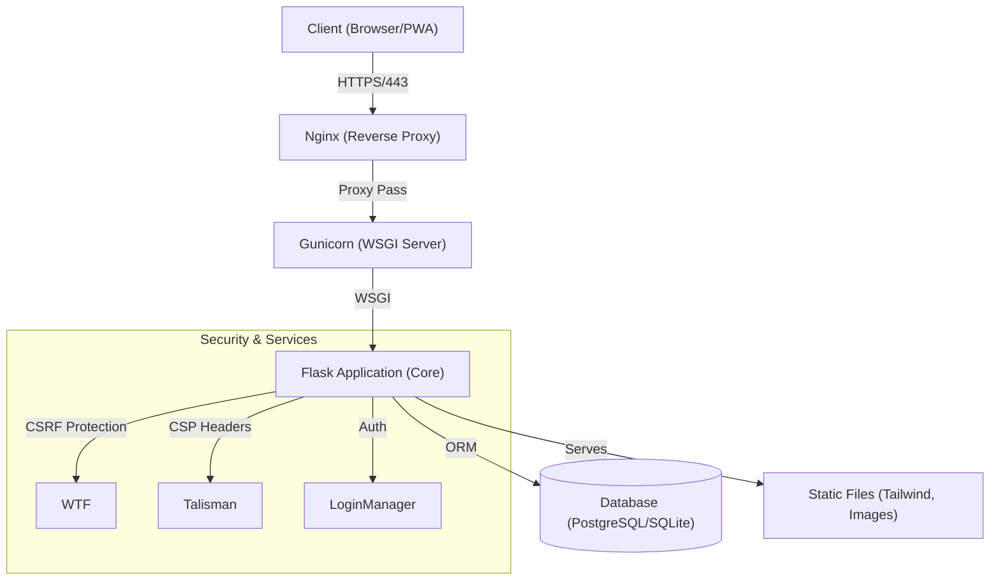

[ 🇫🇷 Français ](README.md) | [ 🇬🇧 English ]

# ⚠️ LEGAL WARNING
**EXCLUSIVE PROPERTY OF MOA DIGITAL AGENCY (myoneart.com)**
**AUTHOR: AISANCE KALONJI**

This source code is **STRICTLY CONFIDENTIAL AND PROPRIETARY**.
Any unauthorized reproduction, distribution, or modification is prohibited.
Internal use only. See the `LICENSE` file for details.

---

# 🏗️ Bellari Concept - CMS & Interior Design PWA

**Bellari Concept** is a bespoke CMS solution developed for a luxury interior design agency. It combines the power of a robust Flask application with the seamless user experience of a Progressive Web App (PWA).

## 🌟 Product Vision
This is not just a showcase site, but a complete platform allowing the agency to manage its projects, bilingual content, and brand image independently, with enterprise-level security.

## 🏛️ Technical Architecture



## 🚀 Key Features

*   **Native Bilingual Management (FR/EN):** Intelligent synchronization of content sections.
*   **Full PWA Support:** Dynamic manifest, configurable icons, offline mode capable.
*   **Powerful CMS:** Page and section management (Hero, Intro, Features...), and image gallery.
*   **Enhanced Security:** Global CSRF protection, Content Security Policy (CSP), Secure Cookies, Argon2 Hashing.
*   **SEO Optimization:** Dynamic Meta tags, Automatic XML Sitemap, Configurable Robots.txt.

## 📚 Official Documentation

Complete documentation is available in the `docs/` directory:

*   **[ 📜 Full Feature List ](docs/BellariConcept_features_full_list_en.md)** : The project "Bible".
*   **[ ⚙️ Technical Architecture ](docs/BellariConcept_Technical_Architecture_en.md)** : Stack, DB, Deployment.
*   **[ 📖 User & Admin Guide ](docs/BellariConcept_Admin_Guide_en.md)** : CMS user manual.

## 🛠️ Installation & Getting Started (Internal)

### Prerequisites
*   Python 3.11+
*   PostgreSQL (Production) or SQLite (Dev)
*   Virtual Environment (venv)

### Quick Setup
1.  Clone the repository (Restricted access).
2.  Create a `.env` file based on `.env.example` (or see `deploy.sh`).
3.  Install dependencies:
    ```bash
    pip install -r requirements.txt
    ```
4.  Initialize the database:
    ```bash
    python init_db.py
    ```
5.  Start the development server:
    ```bash
    python app.py
    ```

---
© 2024-2025 MOA Digital Agency (myoneart.com) - Author: Aisance KALONJI. All rights reserved.
