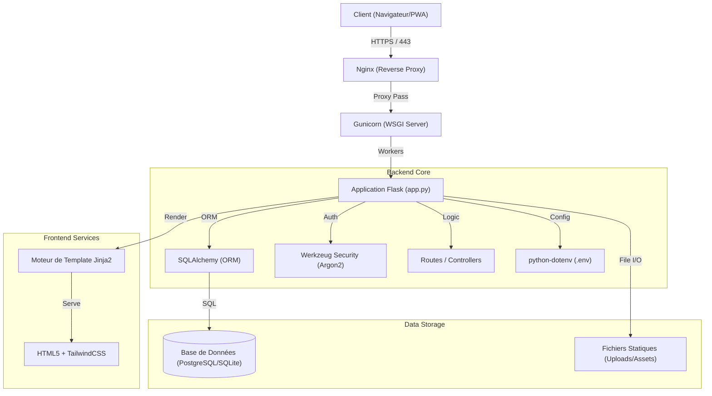

> **© MOA Digital Agency (myoneart.com) - Auteur : Aisance KALONJI**
> *Ce code est la propriété exclusive de MOA Digital Agency. Usage interne uniquement. Toute reproduction ou distribution non autorisée est strictement interdite.*

[Switch to English Version](./BellariConcept_architecture_en.md)

# Architecture Globale - Bellari Concept

## 1. Vue d'Ensemble
L'architecture de Bellari Concept repose sur un modèle **MVC (Modèle-Vue-Contrôleur)** implémenté via le micro-framework Flask. Elle est conçue pour la performance, la sécurité et la maintenabilité sur des environnements VPS Linux (Ubuntu).

L'application sert à la fois de site vitrine haut de gamme et de CMS propriétaire pour la gestion de contenu bilingue.

## 2. Diagramme d'Architecture

## 3. Stack Technique

| Composant | Technologie | Rôle |
| :--- | :--- | :--- |
| **Langage** | Python 3.11+ | Logique backend et scripts de maintenance. |
| **Framework** | Flask 3.0 | Routage, gestion des requêtes HTTP. |
| **ORM** | SQLAlchemy | Abstraction de la base de données. |
| **Serveur WSGI** | Gunicorn | Serveur d'application pour la production. |
| **Base de Données** | PostgreSQL 15 | Stockage relationnel (Pages, Sections, Users, Settings). |
| **Frontend** | Jinja2 + HTML5 | Moteur de template côté serveur. |
| **Styling** | TailwindCSS | Framework CSS utilitaire (via CDN). |
| **Sécurité** | Flask-WTF / Talisman | Protection CSRF et Content Security Policy (CSP). |

## 4. Structure des Données Clés

*   **Page :** Entité principale (Home, About, etc.).
*   **Section :** Blocs de contenu modulaires liés à une Page.
*   **User :** Administrateurs avec accès sécurisé.
*   **SiteSettings :** Configuration dynamique (Logos, Liens Sociaux, PWA).
*   **Image :** Gestion des médias uploadés.

## 5. Flux de Déploiement

Le déploiement est automatisé via `deploy.sh` qui :
1.  Vérifie les dépendances système.
2.  Installe les paquets Python via `uv` ou `pip`.
3.  Exécute `verify_deployment.py` pour valider l'environnement.
4.  Lance `init_db.py` pour les migrations de schéma manuelles.
5.  Configure et démarre Gunicorn/Nginx.
