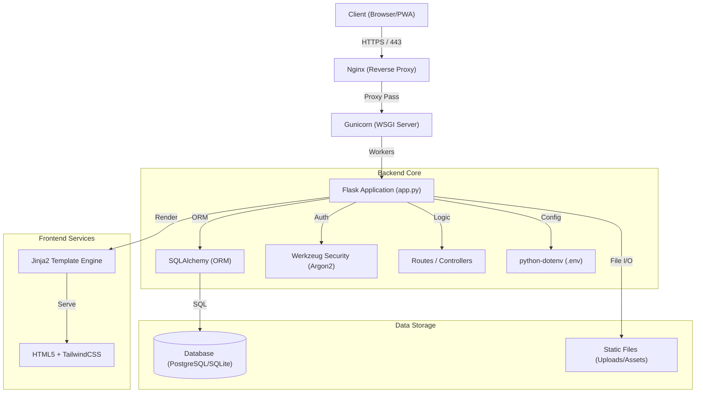

> **© MOA Digital Agency (myoneart.com) - Author: Aisance KALONJI**
> *This code is the exclusive property of MOA Digital Agency. Internal use only. Any unauthorized reproduction or distribution is strictly prohibited.*

[Passer à la version Française](./BellariConcept_architecture.md)

# Global Architecture - Bellari Concept

## 1. Overview
The Bellari Concept architecture is based on the **MVC (Model-View-Controller)** pattern implemented via the Flask micro-framework. It is designed for performance, security, and maintainability on Linux VPS environments (Ubuntu).

The application serves as both a high-end showcase site and a proprietary CMS for bilingual content management.

## 2. Architecture Diagram

## 3. Tech Stack

| Component | Technology | Role |
| :--- | :--- | :--- |
| **Language** | Python 3.11+ | Backend logic and maintenance scripts. |
| **Framework** | Flask 3.0 | Routing, HTTP request management. |
| **ORM** | SQLAlchemy | Database abstraction. |
| **WSGI Server** | Gunicorn | Application server for production. |
| **Database** | PostgreSQL 15 | Relational storage (Pages, Sections, Users, Settings). |
| **Frontend** | Jinja2 + HTML5 | Server-side template engine. |
| **Styling** | TailwindCSS | Utility-first CSS framework (via CDN). |
| **Security** | Flask-WTF / Talisman | CSRF protection and Content Security Policy (CSP). |

## 4. Key Data Structures

*   **Page:** Main entity (Home, About, etc.).
*   **Section:** Modular content blocks linked to a Page.
*   **User:** Administrators with secure access.
*   **SiteSettings:** Dynamic configuration (Logos, Social Links, PWA).
*   **Image:** Uploaded media management.

## 5. Deployment Flow

Deployment is automated via `deploy.sh` which:
1.  Checks system dependencies.
2.  Installs Python packages via `uv` or `pip`.
3.  Executes `verify_deployment.py` to validate the environment.
4.  Runs `init_db.py` for manual schema migrations.
5.  Configures and starts Gunicorn/Nginx.
