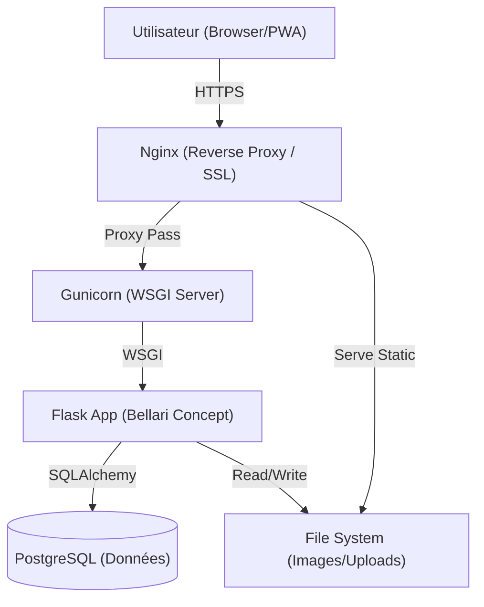
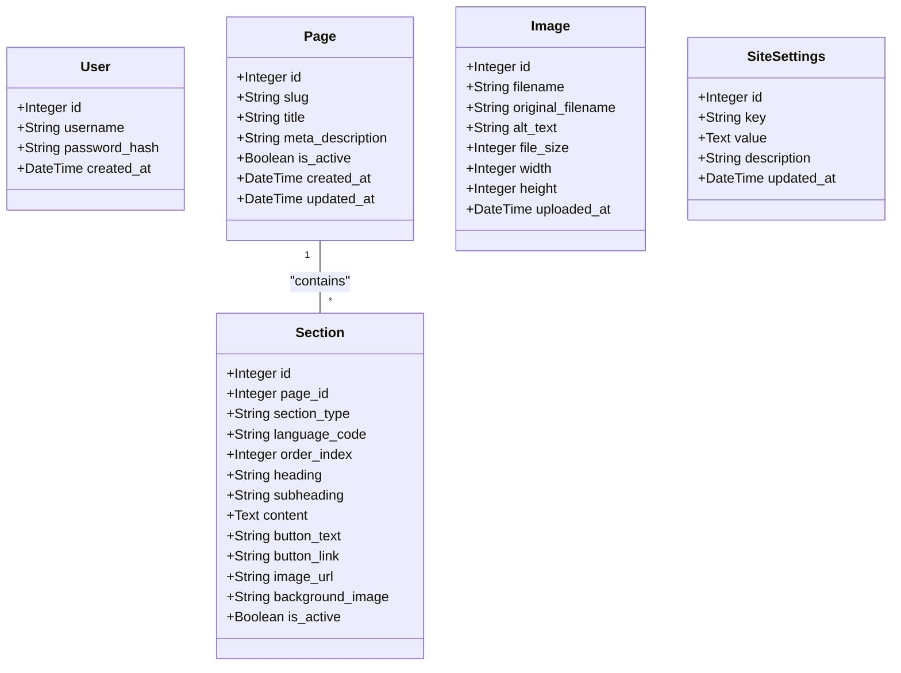

# Bellari Concept - Architecture Technique

Ce document détaille l'architecture logicielle, la structure de la base de données et les flux de sécurité de l'application Bellari Concept.

## 1. Vue d'Ensemble

L'application suit une architecture monolithique classique, optimisée pour le déploiement sur VPS avec une séparation claire entre le serveur web, le serveur d'application et la base de données.

---

## 2. Stack Technologique

### Backend
*   **Langage :** Python 3.10+
*   **Framework Web :** Flask (Micro-framework)
*   **ORM :** SQLAlchemy (Abstraction de la base de données)
*   **Sécurité :**
    *   `Werkzeug` (Hachage Argon2)
    *   `Flask-Login` (Gestion de session utilisateur)
    *   `Flask-WTF` (Protection CSRF)
    *   `Flask-Talisman` (Content Security Policy & HTTPS)

### Frontend
*   **Templating :** Jinja2 (Rendu côté serveur)
*   **CSS Framework :** TailwindCSS (v3 via CDN pour légèreté et rapidité d'itération)
*   **JavaScript :** Vanilla JS (ES6+)
    *   `main.js` : Logique de navigation mobile.
    *   `pwa.js` : Gestion du Service Worker et des prompts d'installation.

### Infrastructure & Déploiement
*   **Base de Données :**
    *   Développement : SQLite (`instance/site.db`)
    *   Production : PostgreSQL (via `DATABASE_URL`)
*   **Serveur d'Application :** Gunicorn (Production WSGI)
*   **Serveur Web (Reverse Proxy) :** Nginx (Recommandé en front du VPS)

---

## 3. Modèle de Données (Entités)

Le schéma de base de données est conçu pour la flexibilité du CMS et la performance.

### Relations Clés
*   **Page -> Section :** Une `Page` (ex: "Accueil") contient plusieurs `Section`s.
*   **Pairing FR/EN :** Il n'y a pas de relation explicite en base de données entre une section FR et sa version EN. Le lien est **logique** et maintenu par l'application via `order_index` et `section_type`.

---

## 4. Flux de l'Application

### Cycle de Vie d'une Requête (Request Lifecycle)

1.  **Entrée (WSGI) :** Gunicorn reçoit la requête HTTP.
2.  **Middleware de Sécurité (`Talisman`) :**
    *   Force HTTPS.
    *   Applique les en-têtes de sécurité (HSTS, X-Frame-Options).
    *   Vérifie la Content Security Policy (CSP).
3.  **Routing (`app.route`) :** Flask dirige la requête vers la fonction de vue appropriée.
4.  **Pré-traitement (`before_request`) :**
    *   `flask_login` vérifie la session utilisateur.
    *   `flask_wtf.csrf` valide le token CSRF pour les requêtes POST.
5.  **Logique Métier :**
    *   La vue interroge la base de données via SQLAlchemy (`Page.query...`).
    *   Traitement des formulaires, uploads, etc.
6.  **Injection de Contexte (`context_processor`) :**
    *   La fonction `inject_site_settings` est appelée.
    *   Elle charge `SiteSettings` (logo, nom du site, liens sociaux) et les rend disponibles pour *tous* les templates.
7.  **Rendu (Jinja2) :**
    *   Le template `base.html` est rendu avec les données injectées.
    *   Les blocs spécifiques (``) sont remplis par les templates enfants (ex: `index.html`).
8.  **Réponse :** Le HTML généré est renvoyé au client avec les cookies de session sécurisés.

### Architecture Frontend

*   **`base.html` :** Squelette commun. Contient le `<head>` (SEO, Méta, CSS), la `<nav>` (Menu) et le `<footer>`.
*   **`templates/admin/` :** Interface d'administration séparée, protégée par `@login_required`.
*   **`static/` :**
    *   `css/` : Styles personnalisés (par-dessus Tailwind).
    *   `js/` : Scripts légers sans dépendance NPM.
    *   `uploads/` : Dossier de stockage des images CMS (doit être persistant).

---

## 5. Stratégie de Déploiement & Maintenance

### Initialisation (`init_db.py`)
Ce script agit comme un **système de migration autonome**.
Contrairement aux outils classiques qui échouent si l'état de la base diverge légèrement de l'historique, ce script est idempotent :
1.  Vérifie l'existence des tables.
2.  Vérifie l'existence de chaque colonne individuellement.
3.  Ajoute les colonnes manquantes à la volée (`ALTER TABLE`).
4.  Initialise les données par défaut (Admin, Pages exemples) si la base est vide.

### Vérification (`verify_deployment.py`)
Script de "Santé" (Health Check) à exécuter en pré-production :
1.  Valide la structure des dossiers (`static`, `templates`).
2.  Valide la présence des images critiques du thème.
3.  Valide la cohérence des données (Page Home présente, Sections Hero FR+EN présentes).
4.  Valide les variables d'environnement.

### Normalisation (`normalize_sections.py`)
Script de maintenance curatif :
1.  Réaligne les `order_index` de toutes les sections.
2.  Garantit que la section FR #N correspond toujours à la section EN #N, corrigeant les décalages éventuels après des suppressions.
