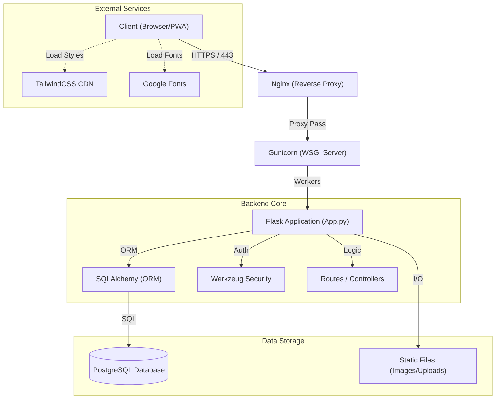

    

# Bellari Concept - System Architecture

> **LEGAL NOTICE**
>
> This document and the described architecture are the exclusive property of **MOA Digital Agency** and **Aisance KALONJI**.
> Internal Use Only.

---

## 1. Overview
The Bellari Concept architecture is designed to be robust, secure, and easily deployable on Linux VPS environments. It follows the **MVC (Model-View-Controller)** pattern adapted for the Flask micro-framework.

### Architecture Diagram


## 2. Technical Stack

| Component | Technology | Role |
| :--- | :--- | :--- |
| **Language** | Python 3.11+ | Backend logic and maintenance scripts. |
| **Web Framework** | Flask 3.0 | Routing, request handling, and application context. |
| **ORM** | SQLAlchemy | Database abstraction (PostgreSQL). |
| **WSGI Server** | Gunicorn | Production application server. |
| **Database** | PostgreSQL 15 | Relational storage (Pages, Sections, Users). |
| **Frontend** | Jinja2 + HTML5 | Server-side template engine. |
| **Styling** | TailwindCSS | Utility-first CSS framework (via CDN). |
| **Security** | Flask-WTF / Talisman | CSRF protection and Content Security Policy (CSP). |

## 3. Project Structure

```text
/
├── app.py                 # Main entry point (Routes, Config, Models)
├── init_db.py             # Schema migration and seeding script
├── deploy.sh              # Deployment automation script
├── verify_deployment.py   # Pre-start checks
├── requirements.txt       # Python dependencies
├── static/                # Static files
│   ├── uploads/           # Admin uploaded images
│   └── js/                # Front-end JS scripts
├── templates/             # Jinja2 templates
│   ├── admin/             # Administration interface
│   ├── errors/            # Error pages (404, 500...)
│   └── *.html             # Public pages
└── docs/                  # Technical documentation (This folder)
```

## 4. Data Flow

### 4.1 Request Processing (Request Lifecycle)
1.  **Input:** Nginx receives the HTTPS request and forwards it to Gunicorn via a UNIX or TCP socket.
2.  **Dispatch:** Flask parses the URL and directs the request to the appropriate view function (`@app.route`).
3.  **Context:**
    *   `load_dotenv()` loads environment variables.
    *   `@before_request` can check language or session.
4.  **Business Logic:**
    *   SQLAlchemy models (`Page`, `Section`) are queried.
    *   Security logic (CSRF, Auth) is validated.
5.  **Rendering:** Jinja2 generates HTML by injecting data (`sections`, `settings`).
6.  **Response:** The HTML is returned to the client with security headers (CSP, HSTS).

### 4.2 Database Management
*   **Connection:** Managed via `DATABASE_URL` in the `.env` file.
*   **Migration:** Unlike classic Alembic, `init_db.py` implements manual column verification at startup to ensure stability on VPS without complex dependencies.

---
*© 2024 MOA Digital Agency. All rights reserved.*
