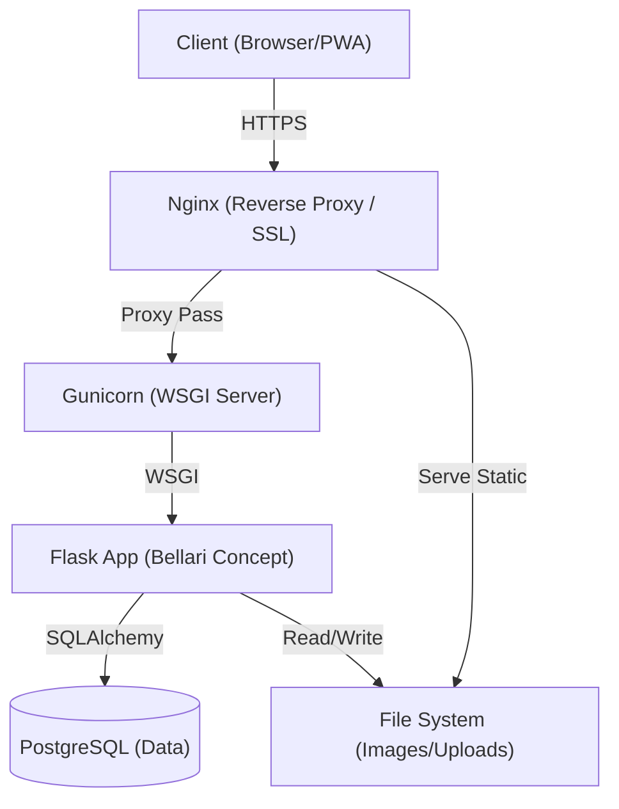
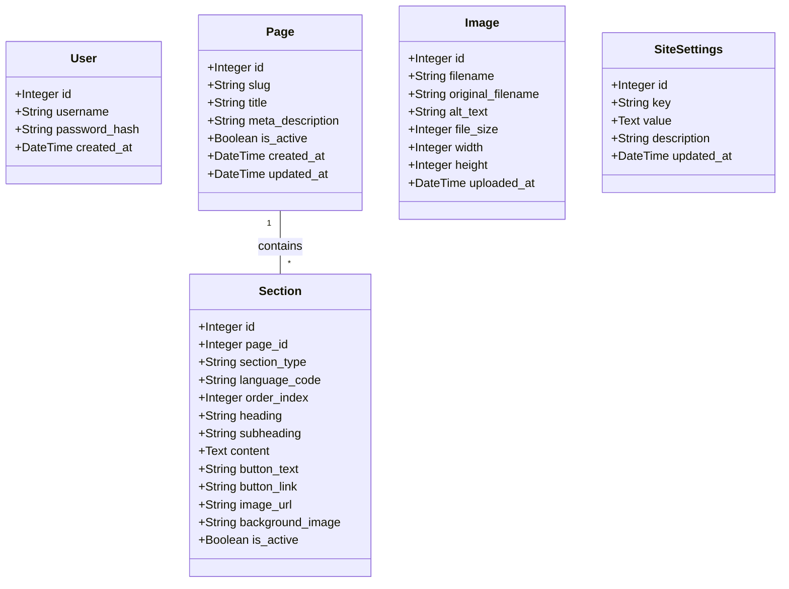

     

# Bellari Concept - Technical Architecture

> **STRICTLY CONFIDENTIAL DOCUMENT**
>
> This software is the exclusive property of **MOA Digital Agency**. Any unauthorized reproduction or distribution is strictly prohibited.

This document details the software architecture, database structure, and security flows of the Bellari Concept application.

## 1. Overview

The application follows a robust monolithic architecture, optimized for VPS deployment with a clear separation between the web server, application server, and database.

---

## 2. Tech Stack

### Backend
*   **Language:** Python 3.11+
*   **Web Framework:** Flask 3.0.0
*   **ORM:** SQLAlchemy (via `flask-sqlalchemy`)
*   **Security:**
    *   `Werkzeug` (Argon2 hashing for passwords)
    *   `Flask-Login` (Secure user session management)
    *   `Flask-WTF` (Global CSRF protection)
    *   `Flask-Talisman` (Content Security Policy & Force HTTPS)

### Frontend
*   **Templating:** Jinja2 (Server-side rendering with context injection)
*   **CSS Framework:** TailwindCSS (via CDN for performance and rapid iteration)
*   **JavaScript:** Vanilla JS (ES6+) for PWA interactivity and UI.

### Infrastructure & Deployment
*   **Database:** PostgreSQL (Production) / SQLite (Development/Fallback)
*   **Application Server:** Gunicorn (Production WSGI)
*   **Web Server:** Nginx (Reverse Proxy, SSL Termination)
*   **Containerization:** Docker compatible (optional), standard deployment via `deploy.sh`.

---

## 3. Data Model (Entities)

The database schema is designed to offer total flexibility to the CMS while maintaining bilingual data integrity.

### Key Relations
*   **Page -> Section:** A `Page` (e.g., "Home") contains multiple ordered `Section`s.
*   **FR/EN Pairing:** Synchronization between French and English content is logically managed by the application via `order_index` and `section_type`. The `normalize_sections.py` script ensures this alignment integrity.

---

## 4. Security Flow & Application Lifecycle

### Request Lifecycle

1.  **Secure Entry:** Nginx terminates the SSL connection and forwards the request to Gunicorn.
2.  **Security Middleware (`Talisman`):**
    *   Forces HTTPS.
    *   Applies strict security headers (HSTS, X-Frame-Options).
    *   Applies a Content Security Policy (CSP) to prevent XSS.
3.  **CSRF Validation:** `Flask-WTF` validates the CSRF token for all POST/PUT/DELETE methods.
4.  **Authentication:** `Flask-Login` verifies the session cookie (Secure, HttpOnly, SameSite=Lax).
5.  **Business Logic & Rendering:**
    *   Views query the DB.
    *   Context processor (`context_processor`) injects global configurations (`SiteSettings`).
    *   Jinja2 generates the final HTML.

### Robust Initialization (`init_db.py`)
The system features a self-healing mechanism at startup:
*   Verification and creation of the database schema.
*   Secure creation of the Admin account via environment variables (`ADMIN_USERNAME`, `ADMIN_PASSWORD`).
*   Population of default content if the database is empty.
