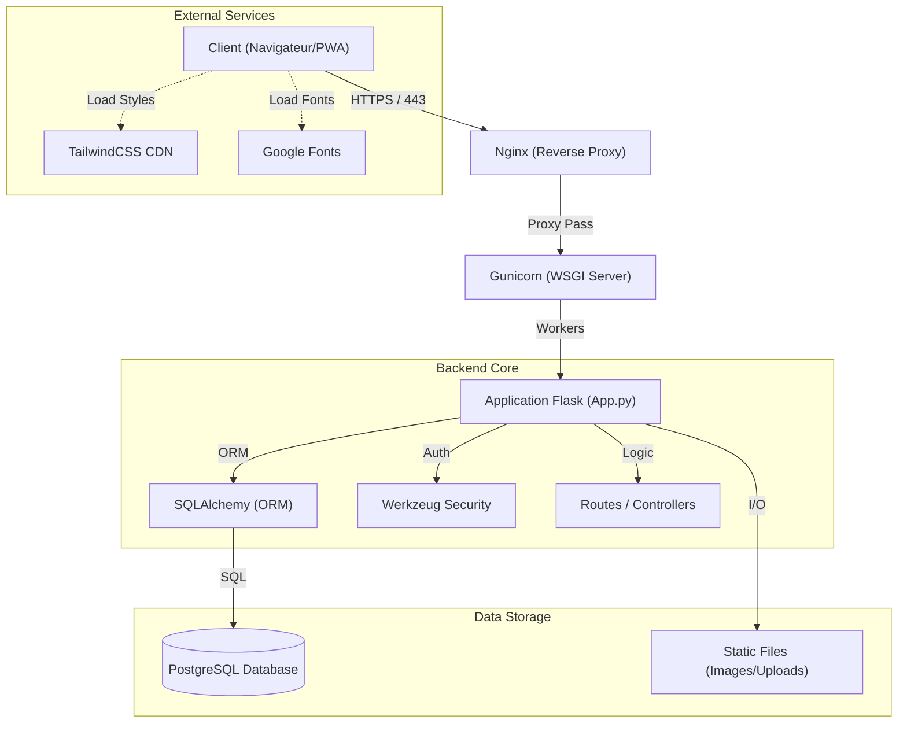

    

# Bellari Concept - Architecture du Système

> **AVERTISSEMENT LÉGAL**
>
> Ce document et l'architecture décrite sont la propriété exclusive de **MOA Digital Agency** et **Aisance KALONJI**.
> Usage interne uniquement.

---

## 1. Vue d'Ensemble
L'architecture de Bellari Concept est conçue pour être robuste, sécurisée et facilement déployable sur des environnements VPS Linux. Elle suit le modèle **MVC (Model-View-Controller)** adapté au micro-framework Flask.

### Diagramme d'Architecture


## 2. Stack Technique

| Composant | Technologie | Rôle |
| :--- | :--- | :--- |
| **Langage** | Python 3.11+ | Logique backend et scripts de maintenance. |
| **Framework Web** | Flask 3.0 | Routage, gestion des requêtes et contexte d'application. |
| **ORM** | SQLAlchemy | Abstraction de la base de données (PostgreSQL). |
| **Serveur WSGI** | Gunicorn | Serveur d'application pour la production. |
| **Base de Données** | PostgreSQL 15 | Stockage relationnel (Pages, Sections, Users). |
| **Frontend** | Jinja2 + HTML5 | Moteur de template côté serveur. |
| **Styling** | TailwindCSS | Framework CSS utilitaire (via CDN). |
| **Sécurité** | Flask-WTF / Talisman | Protection CSRF et Content Security Policy (CSP). |

## 3. Structure du Projet

```text
/
├── app.py                 # Point d'entrée principal (Routes, Config, Modèles)
├── init_db.py             # Script de migration de schéma et de seeding
├── deploy.sh              # Script d'automatisation du déploiement
├── verify_deployment.py   # Vérifications pré-démarrage
├── requirements.txt       # Dépendances Python
├── static/                # Fichiers statiques
│   ├── uploads/           # Images uploadées par l'admin
│   └── js/                # Scripts JS front-end
├── templates/             # Templates Jinja2
│   ├── admin/             # Interface d'administration
│   ├── errors/            # Pages d'erreur (404, 500...)
│   └── *.html             # Pages publiques
└── docs/                  # Documentation technique (Ce dossier)
```

## 4. Flux de Données

### 4.1 Traitement d'une Requête (Request Lifecycle)
1.  **Entrée :** Nginx reçoit la requête HTTPS et la transmet à Gunicorn via un socket UNIX ou TCP.
2.  **Dispatch :** Flask analyse l'URL et dirige la requête vers la fonction de vue (`@app.route`) appropriée.
3.  **Contexte :**
    *   `load_dotenv()` charge les variables d'environnement.
    *   `@before_request` peut vérifier la langue ou la session.
4.  **Logique Métier :**
    *   Les modèles SQLAlchemy (`Page`, `Section`) sont interrogés.
    *   La logique de sécurité (CSRF, Auth) est validée.
5.  **Rendu :** Jinja2 génère le HTML en injectant les données (`sections`, `settings`).
6.  **Réponse :** Le HTML est renvoyé au client avec les en-têtes de sécurité (CSP, HSTS).

### 4.2 Gestion de la Base de Données
*   **Connexion :** Gérée via `DATABASE_URL` dans le fichier `.env`.
*   **Migration :** Contrairement à Alembic classique, `init_db.py` implémente une vérification manuelle des colonnes au démarrage pour garantir la stabilité sur les VPS sans dépendances complexes.

---
*© 2024 MOA Digital Agency. Tous droits réservés.*
