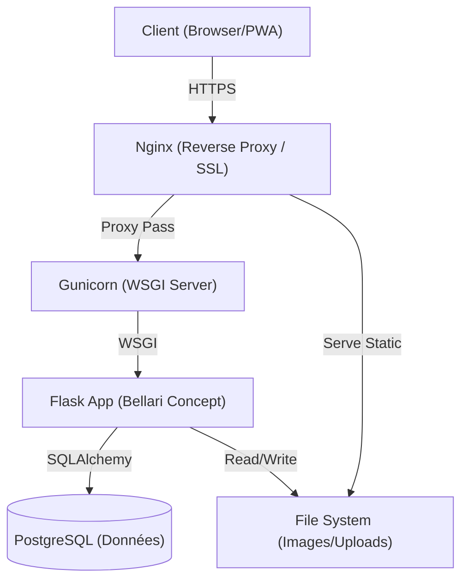
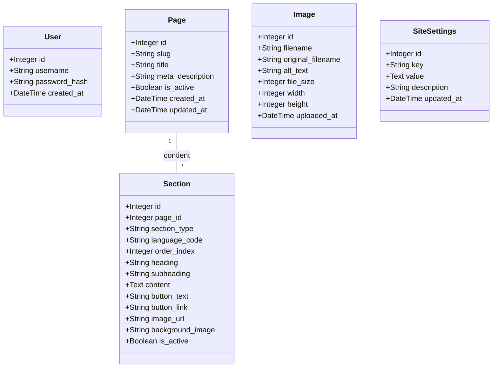

     

# Bellari Concept - Architecture Technique

> **DOCUMENT STRICTEMENT CONFIDENTIEL**
>
> Ce logiciel est la propriété exclusive de **MOA Digital Agency**. Toute reproduction ou distribution non autorisée est strictement interdite.

Ce document détaille l'architecture logicielle, la structure de la base de données et les flux de sécurité de l'application Bellari Concept.

## 1. Vue d'Ensemble

L'application suit une architecture monolithique robuste, optimisée pour le déploiement sur VPS avec une séparation claire entre le serveur web, le serveur d'application et la base de données.

---

## 2. Stack Technologique

### Backend
*   **Langage :** Python 3.11+
*   **Framework Web :** Flask 3.0.0
*   **ORM :** SQLAlchemy (via `flask-sqlalchemy`)
*   **Sécurité :**
    *   `Werkzeug` (Hachage Argon2 pour les mots de passe)
    *   `Flask-Login` (Gestion de session utilisateur sécurisée)
    *   `Flask-WTF` (Protection CSRF globale)
    *   `Flask-Talisman` (Content Security Policy & Force HTTPS)

### Frontend
*   **Templating :** Jinja2 (Rendu côté serveur avec injection de contexte)
*   **CSS Framework :** TailwindCSS (via CDN pour performance et itération rapide)
*   **JavaScript :** Vanilla JS (ES6+) pour l'interactivité PWA et UI.

### Infrastructure & Déploiement
*   **Base de Données :** PostgreSQL (Production) / SQLite (Développement/Fallback)
*   **Serveur d'Application :** Gunicorn (WSGI Production)
*   **Serveur Web :** Nginx (Reverse Proxy, SSL Termination)
*   **Containerisation :** Compatible Docker (optionnel), déploiement standard via `deploy.sh`.

---

## 3. Modèle de Données (Entités)

Le schéma de base de données est conçu pour offrir une flexibilité totale au CMS tout en maintenant l'intégrité des données bilingues.

### Relations Clés
*   **Page -> Section :** Une `Page` (ex: "Accueil") contient plusieurs `Section`s ordonnées.
*   **Pairing FR/EN :** La synchronisation entre les contenus Français et Anglais est gérée logiquement par l'application via `order_index` et `section_type`. Le script `normalize_sections.py` assure l'intégrité de cet alignement.

---

## 4. Flux de Sécurité & Application

### Cycle de Vie d'une Requête (Request Lifecycle)

1.  **Entrée Sécurisée :** Nginx termine la connexion SSL et transmet la requête à Gunicorn.
2.  **Middleware de Sécurité (`Talisman`) :**
    *   Force HTTPS.
    *   Applique les en-têtes de sécurité stricts (HSTS, X-Frame-Options).
    *   Applique une Content Security Policy (CSP) pour prévenir les XSS.
3.  **Validation CSRF :** `Flask-WTF` valide le token CSRF pour toutes les méthodes POST/PUT/DELETE.
4.  **Authentification :** `Flask-Login` vérifie le cookie de session (Secure, HttpOnly, SameSite=Lax).
5.  **Logique Métier & Rendu :**
    *   Les vues interrogent la DB.
    *   Le processeur de contexte (`context_processor`) injecte les configurations globales (`SiteSettings`).
    *   Jinja2 génère le HTML final.

### Initialisation Robuste (`init_db.py`)
Le système dispose d'un mécanisme d'auto-réparation au démarrage :
*   Vérification et création du schéma de base de données.
*   Création sécurisée du compte Admin via variables d'environnement (`ADMIN_USERNAME`, `ADMIN_PASSWORD`).
*   Population du contenu par défaut si la base est vide.
