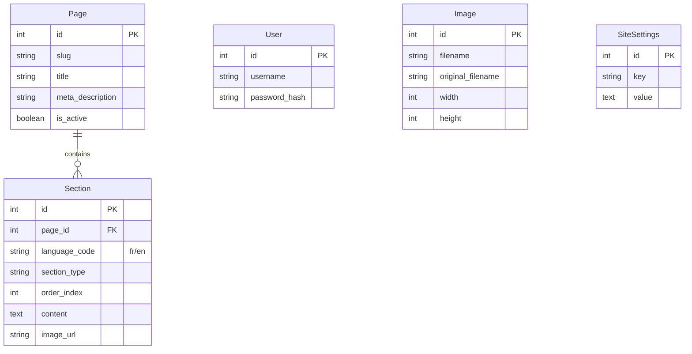

# Bellari Concept - Architecture Technique

Ce document détaille l'architecture logicielle, la structure de la base de données et les mécanismes de sécurité de l'application Bellari Concept.

---

## 1. Vue d'Ensemble

L'application est construite sur le micro-framework **Flask** (Python) suivant une architecture monolithique modulaire. Elle privilégie la simplicité et la robustesse pour un déploiement facile sur des serveurs VPS ou des conteneurs.

### Stack Technologique
*   **Backend :** Python 3.11+, Flask 3.0.
*   **Base de Données :** PostgreSQL (Production) ou SQLite (Développement).
*   **ORM :** SQLAlchemy.
*   **Frontend :** Jinja2 (Templating), Tailwind CSS (Styling), Vanilla JS.
*   **Serveur WSGI :** Gunicorn.

---

## 2. Structure du Projet

```
.
├── app.py                 # Cœur de l'application (Routes, Modèles, Config)
├── init_db.py             # Script de migration manuelle et de seeding
├── static/                # Fichiers statiques servis par Nginx/Gunicorn
│   ├── uploads/           # Images uploadées par l'utilisateur
│   ├── js/                # Scripts JS spécifiques
│   └── css/               # Feuilles de style (si non-Tailwind)
├── templates/             # Vues Jinja2
│   ├── admin/             # Templates du back-office
│   │   ├── base.html      # Layout admin (Sidebar, Header)
│   │   ├── edit_page.html # Éditeur de contenu complexe
│   │   └── ...
│   ├── base.html          # Layout public (Navbar, Footer)
│   ├── index.html         # Page d'accueil
│   └── ...
└── requirements.txt       # Dépendances Python
```

---

## 3. Modélisation des Données (Schéma BDD)

L'application utilise une approche relationnelle standard.

### Diagramme Entité-Relation Simplifié



### Explications des Choix Techniques

1.  **Page vs Section :**
    *   Une `Page` représente une URL accessible (ex: `/about`).
    *   Une `Section` est un bloc de contenu au sein de cette page.
    *   **Avantage :** Flexibilité totale. On peut ajouter autant de blocs "Texte", "Image", ou "Appel à l'action" que nécessaire sans modifier le schéma de la base.

2.  **Gestion du Multilingue (Section) :**
    *   Au lieu de dupliquer les tables (ex: `PageFR`, `PageEN`), chaque `Section` porte un attribut `language_code`.
    *   Le frontend filtre les sections : `Section.query.filter_by(page_id=X, language_code='fr')`.
    *   **Avantage :** Permet d'avoir des structures de page différentes selon la langue si nécessaire, bien que l'admin favorise la symétrie.

3.  **SiteSettings (Clé-Valeur) :**
    *   Table fourre-tout pour la configuration (Logo, SEO, Liens sociaux).
    *   **Avantage :** Ajout de nouveaux paramètres sans migration de base de données.

### Système de Migration "Manuelle" (`init_db.py`)
Contrairement à Alembic qui nécessite des fichiers de version, `init_db.py` inspecte la base au démarrage :
1.  Vérifie l'existence des tables.
2.  Inspecte les colonnes de chaque table.
3.  Si une colonne manque (ex: après une mise à jour du code), elle est ajoutée via une commande SQL brute (`ALTER TABLE`).
*   **Pourquoi ?** Garantit que l'application fonctionne immédiatement après un `git pull` sur un VPS, sans commande complexe.

---

## 4. Architecture de Sécurité

### Authentification & Sessions
*   **Flask-Login :** Gère la session utilisateur.
*   **Protection de Session :**
    *   `SESSION_COOKIE_HTTPONLY = True` : Empêche le vol de cookie par XSS.
    *   `SESSION_COOKIE_SECURE = True` : Cookies envoyés uniquement en HTTPS.
    *   `SESSION_COOKIE_SAMESITE = 'Lax'` : Protection CSRF additionnelle.

### Protection CSRF (Cross-Site Request Forgery)
*   **Flask-WTF :**
    *   Chaque formulaire POST (Login, Édition, Upload) doit inclure un `<input type="hidden" name="csrf_token">`.
    *   Les appels AJAX doivent inclure le header `X-CSRFToken`.
    *   Si le token est manquant ou invalide, l'application renvoie une erreur 400.

### Content Security Policy (CSP)
*   **Flask-Talisman :** Injecte des en-têtes de sécurité stricts.
*   **Configuration :**
    *   `default-src 'self'` : Par défaut, tout doit venir du même domaine.
    *   `style-src` : Autorise `'unsafe-inline'` (nécessaire pour certains styles dynamiques) et les polices Google.
    *   `img-src` : Autorise les images locales et les Data URIs (base64).
    *   **Note :** Le CDN Tailwind est whitelisté.

---

## 5. Flux de Requête (Request Flow)

1.  **Entrée :** Gunicorn reçoit la requête HTTP sur le port 5000.
2.  **Middleware :** Talisman vérifie/force HTTPS et ajoute les en-têtes de sécurité.
3.  **Routing Flask :**
    *   Si la route est `/static/...`, le fichier est servi (en dev) ou délégué à Nginx (en prod).
    *   Si la route est dynamique (ex: `/about`), le contrôleur `about()` est appelé.
4.  **Contrôleur :**
    *   Récupère la langue depuis la session.
    *   Requête la table `Page` par slug.
    *   Requête les `Section` associées, filtrées par langue et triées par `order_index`.
5.  **Context Processor :**
    *   `inject_site_settings` injecte globalement les variables `site_name`, `logo_url`, etc.
6.  **Rendu :**
    *   Jinja2 assemble `base.html` + `about.html`.
    *   Les boucles parcourent les sections pour générer le HTML final.
7.  **Sortie :** Réponse HTML envoyée au client avec les cookies de session sécurisés.
